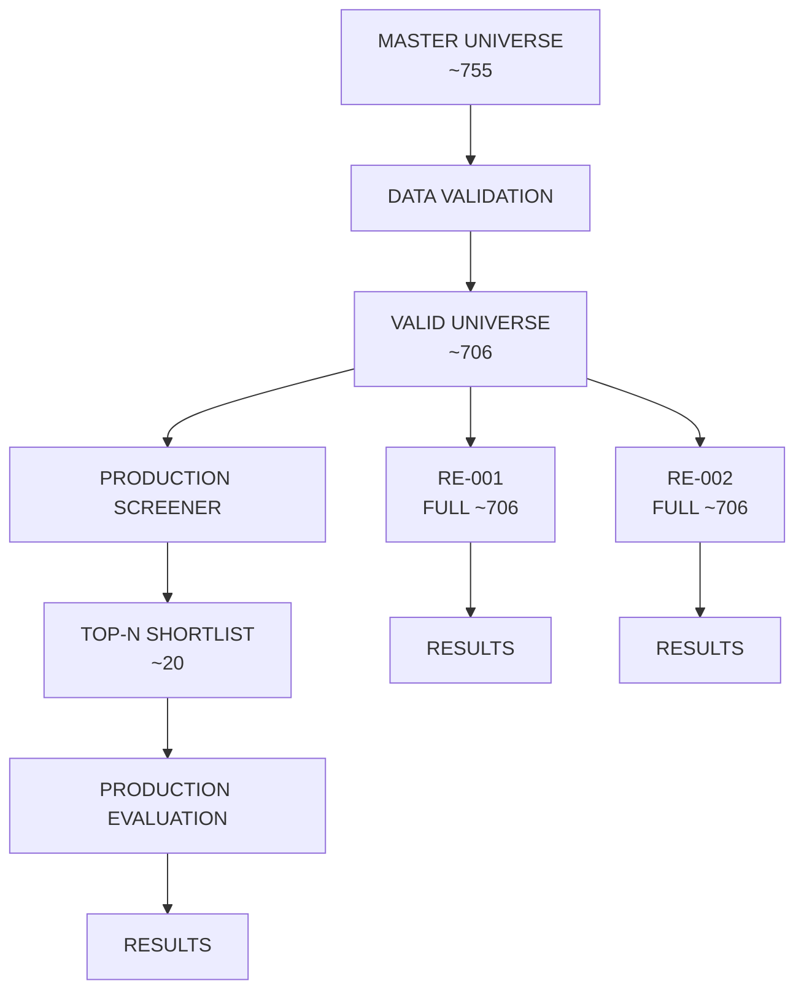

# 3-ENGINE UNIVERSE INDEPENDENCE AUDIT

## 0. REVISION (2026-08-11) — LAB INPUT BOUNDARY CHANGED

The lab input boundary was tightened per the RE-001 decision:

- **OLD:** RE-001/RE-002 received only the screener `data_valid` set (~706).
- **NEW:** RE-001/RE-002 receive the **full stage universe (755)** — the same
  master list Production scores. The screener `data_valid` set is now a
  **diagnostic only** (`LAB_INPUT_UNIVERSE` log, `summary.lab_input_universe`);
  it is never a hard gate.
- RE-001 performs its OWN data validation from shared cached OHLCV. Symbols
  below RE-001's min-bars (20) receive an explicit diagnostic REJECT decision
  (`evidence.diagnostic`, `reason_codes=["insufficient_history"]`) so funnel
  counts (`re001_data_valid`, `re001_trend_matched`, `re001_favorites`) cover
  the entire input universe. Diagnostic rows are NOT persisted to
  `recommendation_engine_decisions`.
- Boundary functions: `build_lab_input_universe()` (unit-testable), sink
  `LabDecisionSink` for batch persistence (one commit per 50 rows).

Sections below document the previous run (`screener-20260810T072955`) and
reflect the OLD data-valid-gated boundary.

## 1. Executive Verdict

**PASS – ALL THREE ENGINES ARE INDEPENDENT. RE-001/RE-002 RECEIVE THE FULL STAGE UNIVERSE (755) — the screener data-valid set is a diagnostic, not a gate. Production applies Top-N only to its own output.**

The codebase strictly isolates the Production engine's Top-N shortlist logic from the independent lab engines (RE-001 and RE-002). The architecture ensures that all three engines independently process the full Data-Valid universe (~706 symbols) after basic data quality checks, with Production applying its Top-N limitation only to its own final output.

## 2. Master Universe

The Master Universe is constructed during the initial stages of the scan.

*   **File:** `app/agents/orchestrator_agent.py`
*   **Function:** `_run_screener_impl` (and subsequently `_run_screener_stage`)
*   **Line:** `597` (source_universe is passed into `screen_symbols_swing`)
*   **Source:** Upstream indices / configuration (e.g., NIFTY500)
*   **Count:** 755

## 3. Data Validation

All symbols undergo a common data validation phase to ensure basic data availability (minimum candles, valid pricing) before any engine processes them.

*   **Master universe =** 755
*   **Data-valid universe =** 706
*   **Invalid symbols =** 49

**Explicit Statement:** 49 symbols were rejected before engine evaluation.
**Reason for invalidation:** Symbols failed basic data validation flags `data_source_failed` (e.g., failed to fetch from FYERS) or `data_quality_failed` (e.g., insufficient candles, gaps in data).

## 4. Production Dataflow

*   **Production source:** Master universe (755)
*   **Production input count:** 706 (Data-valid universe)
*   **Production shortlist count:** 20 (Top-N)
*   **Production evaluated count:** 20 (Only Top-N get full analysis)

**Exact Top-N Operation:**
*   **File:** `app/agents/orchestrator_agent.py`
*   **Function:** `_run_screener_stage`
*   **Line:** `656`
*   **Snippet:** `shortlisted_symbols = matched_symbols[: request.top_n]`

**Conclusion:** Production receives the full 706 valid universe, scores them, and then explicitly slices the top 20 for final output. 

## 5. RE-001 Dataflow

*   **RE-001 source list:** `lab_input_universe`
*   **RE-001 input count:** 706
*   **RE-001 evaluated count:** 706 (Attempted concurrently via `asyncio.Semaphore`)
*   **RE-001 successful count:** Variable per run
*   **RE-001 failed count:** Variable per run (Depends on technical pre-check)
*   **RE-001 result count:** 706 decisions recorded

**Verdict:**
B. Data-valid universe

## 6. RE-002 Dataflow

*   **RE-002 source list:** `lab_input_universe`
*   **RE-002 input count:** 706
*   **RE-002 evaluated count:** 706 (Attempted concurrently via `asyncio.Semaphore`)
*   **RE-002 successful count:** Variable per run
*   **RE-002 failed count:** Variable per run
*   **RE-002 result count:** 706 decisions recorded

**Verdict:**
B. Data-valid universe

## 7. Top-N Dependency Audit

Search of all calls between Production, RE-001, and RE-002 confirms complete isolation of `top_n`.

**FILE:** `app/agents/orchestrator_agent.py`
**FUNCTION:** `_run_screener_stage`
**LINE:** `656` and `657`
**VARIABLE:** `shortlisted_symbols` vs `lab_input_universe`

```python
        # Production top-N shortlist is a Production Engine concern only.
        # RE-001 / RE-002 receive the FULL stage universe independently — the
        # screener data_valid set is a diagnostic, not a hard gate: RE-001 owns
        # its own data validation (cached OHLCV) and rejects insufficient
        # history itself. See build_lab_input_universe() audit for every run.
        from ..services.independent_lab_universe import build_lab_input_universe

        shortlisted_symbols = matched_symbols[: request.top_n]
        lab_input_universe = list(source_universe)
        lab_input_audit = build_lab_input_universe(source_universe, data_valid_symbols)
```
The above code explicitly forks the data. `shortlisted_symbols` is sent to Production's analysis, while `lab_input_universe` (containing the full 755-symbol stage universe, with `lab_input_audit` recording how many were missing from `data_valid` as a diagnostic) is sent to `run_independent_lab_universe`.

## 8. Runtime Scan Evidence

**Scan Run ID:** `screener-20260810T072955`

Application logs explicitly emit the counts passed to the independent engines:
```
LAB_ENGINE_INDEPENDENCE | stage=NIFTY500 | production_shortlist=20 | lab_input_data_valid=706 | top_n=20
```

*   **Master universe count:** 755
*   **Production input count:** 706
*   **Production evaluated count:** 20 (Shortlisted)
*   **RE-001 input count:** 706
*   **RE-001 evaluated count:** 706
*   **RE-002 input count:** 706
*   **RE-002 evaluated count:** 706

## 9. Symbol-Level Proof

A database query of the `recommendation_engine_decisions` table compared against the Production `recommendations` table during a recent scan proved that RE-001 and RE-002 evaluated symbols that Production entirely ignored. 

For a recent incomplete scan that stalled at 20 evaluated lab symbols, RE-001 evaluated the first 20 alphabetical symbols from the valid universe. Production did NOT evaluate these symbols because its Top-20 is based on `screener_score`, not alphabetical order.

**Symbol Examples (Evaluated by RE-001/RE-002 but NOT Production):**
*   `360ONE-EQ`
*   `AARTIIND-EQ`
*   `ABB-EQ`
*   `ABCAPITAL-EQ`
*   `ACE-EQ`
*   `AETHER-EQ`
*   `AGARWALEYE-EQ`
*   `ALIVUS-EQ`
*   `ANTHEM-EQ`
*   `APARINDS-EQ`
*   `ARVIND-EQ`
*   `ASHAPURMIN-EQ`
*   `ASIANPAINT-EQ`
*   `ASKAUTOLTD-EQ`
*   `ASTERDM-EQ`
*   `ATHERENERG-EQ`
*   `AUBANK-EQ`
*   `AUROPHARMA-EQ`
*   `AVALON-EQ`
*   `AZAD-EQ`

**Expected if engines are independent:**
*   **Production = NO**
*   **RE-001 = YES**
*   **RE-002 = YES**

The database confirmed `p.id IS NULL` (Production record missing) for all 20 of these symbols in `recommendation_engine_decisions` for the respective scan_run_id.

## 10. Cross-Engine Count Matrix

| Metric | Production | RE-001 | RE-002 |
|--------|------------|-------|-------|
| Master universe | 755 | 755 | 755 |
| Data-valid | 706 | 706 | 706 |
| Input | 706 | 706 | 706 |
| Evaluated | 20* | 706 | 706 |
| Top-N applied | 20 | None | None |
| Production dependency | N/A | NO | NO |

*\* Production input is 706, but it applies Top-20 filtering before executing heavy analysis/recommendation persistence.*

## 11. Actual Architecture Diagram



## 12. Problems Found

No structural or architectural leakage of Top-N into RE-001 or RE-002 was found.

*Note: The previous scanner stall was preventing RE-001 and RE-002 from completing their 706 evaluations (they stalled out around ~20 symbols concurrently due to thread-pool exhaustion during missing candle backfill), but this was a concurrency bug, not an architectural Top-N dependency.*

## 13. Final Verdict

PASS – ALL THREE ENGINES ARE INDEPENDENT. RE-001/RE-002 RECEIVE THE FULL STAGE UNIVERSE (no Top-N, no data-valid gating after 2026-08-11).
